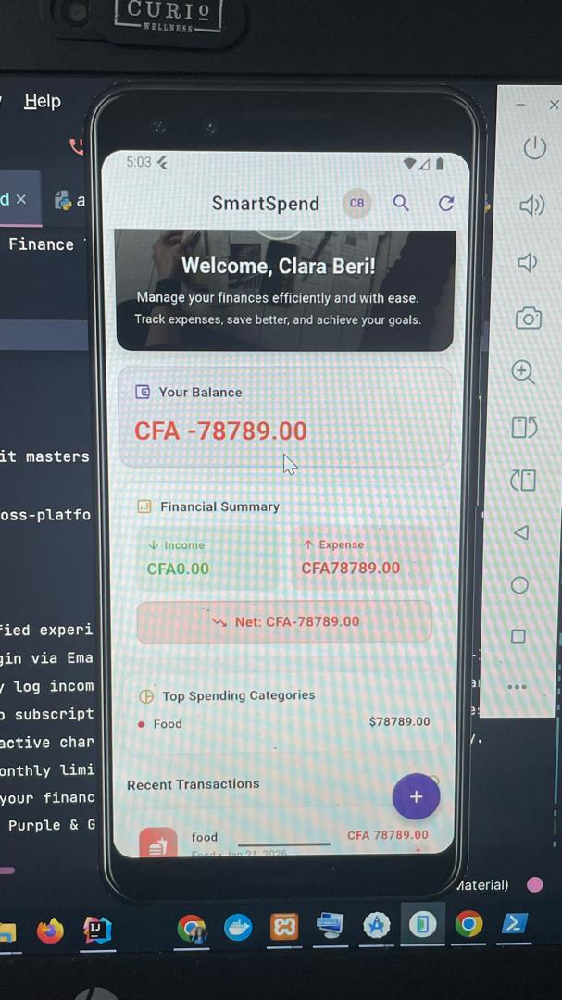
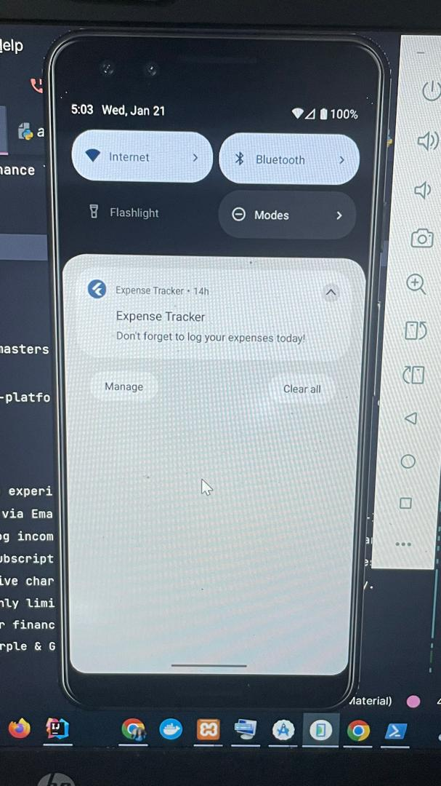

💰 SmartSpend - Intelligent Finance Tracker

SmartSpend is a modern, cross-platform application (Mobile & Web) designed to help users track expenses, manage budgets, and analyze financial habits. Built with Flutter for a beautiful UI and Django for a robust backend.

## 📸 App Screenshots

| Dashboard | Auth_Cross_Browser                                         |Notifications                                         |
|-----------|------------------------------------------------------------|------------------------------------------------------|
|  |  |  |

🚀 Getting Starte

✨ Features

📱 Cross-Platform: Android, iOS, and Web support.

🔐 Secure Authentication: Email/password login + Google Sign-In.

💸 Transaction Management: Track income and expenses efficiently.

🔄 Recurring Transactions: Automate monthly bills and subscriptions.

📊 Interactive Dashboard: Visual spending breakdown by category.

📅 Budgeting Alerts: Set monthly limits and receive notifications.

📂 Export Data: Generate PDF & CSV reports.

🎨 Modern UI: Sleek purple & gold theme with Dark Mode support.

🛠️ Tech Stack
Frontend (Flutter)

Framework: Flutter (Dart)

State Management: Provider

Networking: HTTP & Dio

Charts: fl_chart

Authentication: Google Sign-In

Backend (Django)

Framework: Django (Python)

API: Django REST Framework (DRF)

Database: SQLite (dev) / PostgreSQL (prod)

Authentication: JWT & OAuth2

Documentation: Swagger / Redoc

📂 Folder Structure

Here’s a clear visual of your project:

SmartSpend/
├── Backend/
│   ├── manage.py
│   ├── requirements.txt
│   ├── venv/
│   ├── .env             # NOT committed
│   ├── app/
│   │   ├── migrations/
│   │   ├── models.py
│   │   ├── views.py
│   │   └── ...
│   └── media/           # Uploaded user files
├── frontend_new/
│   ├── android/
│   ├── ios/
│   ├── lib/
│   │   ├── core/
│   │   │   └── config/
│   │   ├── models/
│   │   ├── providers/
│   │   ├── screens/
│   │   ├── widgets/
│   │   └── main.dart
│   ├── build/
│   └── pubspec.yaml
├── .gitignore
└── README.md

Tip: This helps contributors understand your folder structure instantly.

🚀 Getting Started
Prerequisites

Flutter SDK

Python 3.10+

Git

1️⃣ Backend Setup (Django)
cd Backend

# Windows
python -m venv venv
.\venv\Scripts\activate

# Mac/Linux
python3 -m venv venv
source venv/bin/activate

pip install -r requirements.txt
python manage.py migrate
python manage.py runserver

The API runs at: http://127.0.0.1:8000/

2️⃣ Frontend Setup (Flutter)
cd frontend_new
flutter pub get

Configure API URL: Check lib/core/config/api_config.dart

Platform	API URL
Android Emulator	http://10.0.2.2:8000
Web / iOS	http://127.0.0.1:8000

Run the app:

# Android
flutter run

# Web (Chrome)
flutter run -d chrome --web-port=5000

3️⃣ Environment Variables

Create a .env file in Backend/:

SECRET_KEY=your_django_secret_key
DEBUG=True
ALLOWED_HOSTS=127.0.0.1,localhost,10.0.2.2

Important: Never commit .env to Git. Add it to .gitignore.

4️⃣ Screenshots (Add Your Own)

You should replace the placeholders below with real screenshots from your app.

Dashboard	Transactions	Profile

	
	

Tip: Take screenshots for Mobile and Web. Include key features like: Dashboard, Transaction List, Budget Alerts, and Profile screens.

🤝 Contributing

Fork the repository

Create a feature branch: git checkout -b feature/YourFeature

Commit changes: git commit -m "Add YourFeature"

Push: git push origin feature/YourFeature

Open a Pull Request

📄 License

This project is open-source under the MIT License.

⚠️ .gitignore
# --- Django ---
Backend/venv/
Backend/__pycache__/
Backend/*.sqlite3
Backend/.env
Backend/media/
*.pyc

# --- Flutter ---
frontend_new/build/
frontend_new/.dart_tool/
frontend_new/.flutter-plugins
frontend_new/.flutter-plugins-dependencies
frontend_new/.idea/
frontend_new/android/.gradle
frontend_new/ios/.symlinks/
frontend_new/ios/Pods/

# --- IDEs ---
.vscode/
.idea/
*.DS_Store
