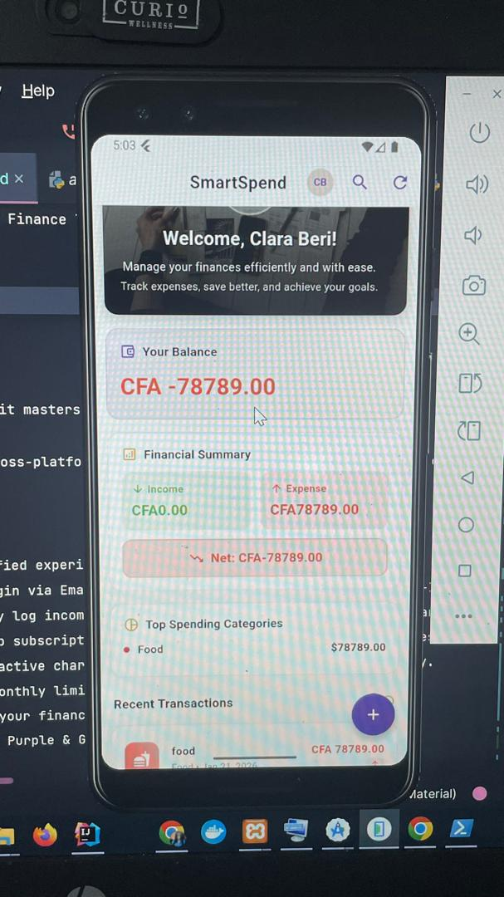
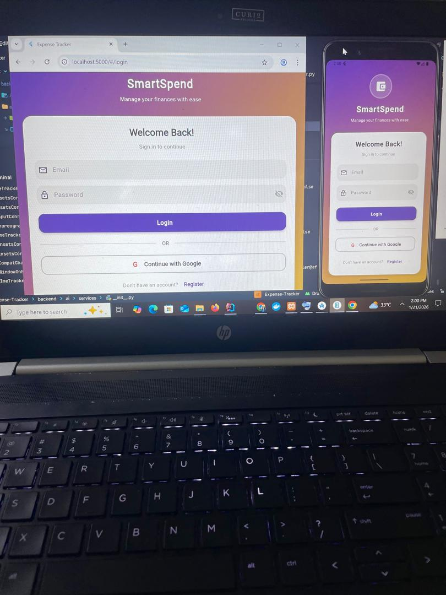
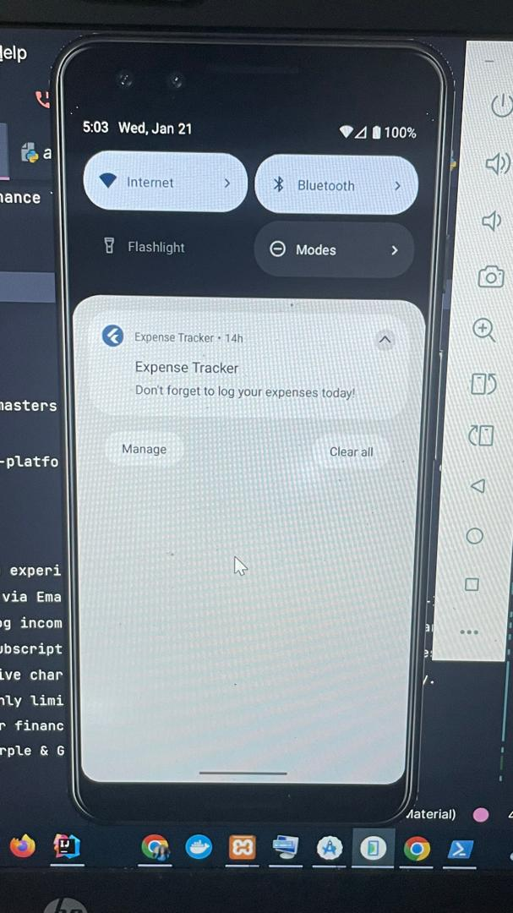

# SmartSpend — Intelligent Finance Tracker

Modern cross-platform personal finance app (Mobile & Web) for tracking expenses, budgets, and financial habits.

## Screenshots

| Dashboard | Auth (Cross-Browser) | Notifications |
|-----------|----------------------|---------------|
|  |  |  |

## Features

- Cross-platform: Android, iOS, Web, Windows
- Secure auth: email/password, Google Sign-In, biometric unlock
- Offline-first: transaction & category sync queues
- Dashboard charts, budget alerts, CSV/PDF export
- Recurring transactions + AI assistant
- English/French localization

## Tech Stack

| Layer | Stack |
|-------|-------|
| Frontend | Flutter, Provider, Hive, fl_chart |
| Backend | Django 5, DRF, SimpleJWT |
| Database | SQLite (local dev) / MySQL (production) |

## Project structure

```
SmartSpend-App/
├── backend/           # Django REST API
├── frontend_new/      # Flutter app
├── assets/            # Screenshots & media
└── .github/workflows/ # CI
```

## Quick start

### 1. Backend

```bash
cd backend
python -m venv venv
.\venv\Scripts\activate          # Windows
pip install -r requirements.txt
copy .env.example .env
python manage.py migrate
python manage.py runserver
```

Set `USE_SQLITE=True` in `.env` for local dev without MySQL.

### 2. Frontend

```bash
cd frontend_new
flutter pub get
flutter run -d chrome --web-port=5000
```

Full setup details (Google OAuth, env vars, tests): see **[frontend_new/README.md](frontend_new/README.md)**.

## Contributing

1. Fork the repo
2. Create a branch: `git checkout -b feature/your-feature`
3. Commit and push
4. Open a Pull Request

## License

MIT License
